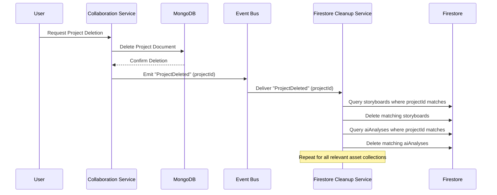

# ADR-001: Cross-Service Data Management Strategy

## Status

Proposed

## Context

The platform integrates multiple services, primarily the `collaboration-service` (MongoDB backend) and various AI services (Firestore backend). Data related to a single logical entity (e.g., a "Project") and its associated creative assets can be distributed across these database systems. This ADR outlines a strategy to manage data consistency and relationships effectively between these services.

## Decision

### Section 1: Entity Ownership

- **Projects:** Owned and primarily managed by the `collaboration-service`. All project-level data, metadata, and core information will be stored in the MongoDB instance associated with this service.
- **Creative Assets:** Creative assets, including but not limited to Storyboards, AI analysis results (e.g., scene detection outputs), and generated media (e.g., synthesized voiceovers, image renders), are primarily managed by the respective AI services. These assets will be stored in Firestore.

### Section 2: Referencing Strategy

To maintain a clear link between creative assets and their parent projects, the following referencing strategy will be adopted:

- Firestore documents representing creative assets will include a dedicated field named `projectId`.
- This `projectId` field will store the string representation of the MongoDB Project's `_id`. This ensures a direct and unambiguous link back to the authoritative Project record in the `collaboration-service`.

**Example:**

A Storyboard document stored in Firestore for a project with MongoDB `_id` of `60d5f1b2c3d4e5f6g7h8i9j0` will include the following field:

```json
{
  "title": "My Awesome Storyboard",
  "scenes": [...],
  "projectId": "60d5f1b2c3d4e5f6g7h8i9j0"
  // ... other storyboard fields
}
```

## Decision (Section 3: Data Consistency Strategy - Deletion Synchronization)

To maintain data integrity when a Project is deleted, an event-driven approach will be implemented.

**Mechanism:**

1.  **Event Emission:** When a Project is successfully deleted from the `collaboration-service` (MongoDB), the service will emit a `ProjectDeleted` event. This event will contain at least the `projectId` (the string representation of the deleted Project's MongoDB `_id`).
    *   The specific eventing mechanism (e.g., Google Cloud Pub/Sub, custom event bus) will be determined during implementation, prioritizing reliability and integration with existing cloud infrastructure.

2.  **Firestore Cleanup Service/Function:**
    *   A new, lightweight service or serverless function (e.g., a Google Cloud Function) will be created. This component will be responsible for listening to `ProjectDeleted` events.
    *   Upon receiving a `ProjectDeleted` event, this service will:
        *   Query all relevant Firestore collections that store project-specific assets (e.g., `storyboards`, `aiAnalyses`, `generatedMedia`).
        *   For each collection, it will find and delete all documents where the `projectId` field matches the `projectId` from the event.
        *   Robust error handling and logging will be implemented within this service to manage cases where documents might not be found or deletion fails.

**Diagram (Conceptual Event Flow for Deletion):**



### Data Consistency for Project Updates

While deletion synchronization is critical, updates to Project metadata also need consideration.

**General Principle: Single Source of Truth and Minimal Duplication**

*   The MongoDB record for a Project within the `collaboration-service` will remain the **single source of truth** for all project-level metadata (e.g., name, description, member list).
*   Creative asset documents in Firestore should generally **avoid duplicating** this information. Instead, UIs or services requiring project details for a given asset should fetch the latest project information from the `collaboration-service` using the `projectId`.

**Handling Denormalized Data (If Necessary):**

In rare cases where specific project metadata *must* be denormalized into Firestore documents (e.g., for performance-critical filtering or direct display where an extra API call is prohibitive), consistency will be maintained using a similar event-driven approach:

1.  **Event Emission:** If a relevant field in a Project document is updated in the `collaboration-service` (e.g., `name`), the service will emit a `ProjectUpdated` event. This event will include the `projectId` and the changed data (e.g., `{ newName: "New Project Title" }`).
2.  **Update Propagation:** The same (or a similar) Firestore Cleanup/Synchronization Service/Function that handles deletions would also subscribe to `ProjectUpdated` events.
3.  Upon receiving an event, it would query relevant Firestore collections for documents matching the `projectId` and update the denormalized fields accordingly.

**Recommendation:**

*   Minimize denormalization of project metadata into Firestore.
*   For most use cases, fetching project data on-demand from the `collaboration-service` (which can be cached client-side or at the API gateway level) is preferred to reduce complexity and potential inconsistencies.
*   If denormalization is chosen for specific, justified reasons, the event-driven synchronization described above must be implemented for those fields.

**Rationale for Event-Driven Approach:**

*   **Decoupling:** This approach decouples the `collaboration-service` from the AI services and Firestore. The `collaboration-service` does not need to know the specifics of where or how creative assets are stored, nor does it need direct API access to Firestore or AI services. It only needs to announce that a project has been deleted.
*   **Resilience & Scalability:** Using a message queue or event bus can improve resilience. If the cleanup service is temporarily down, events can be queued and processed later (depending on the event bus configuration). This architecture also allows the cleanup logic to be scaled independently.
*   **Extensibility:** If new types of creative assets are added in Firestore in the future, the cleanup service can be updated to handle them without requiring changes to the `collaboration-service`.

**Alternatives Considered:**

*   **Direct Synchronous Calls:** The `collaboration-service` could make direct API calls to each AI service (or a central AI gateway) to request deletion of assets. This was rejected due to:
    *   *Increased Coupling:* Tightly links the services.
    *   *Reduced Resilience:* If an AI service is down, the deletion in `collaboration-service` might fail or require complex retry logic within the project deletion flow.
    *   *Complexity:* The `collaboration-service` would need to know about all downstream services and manage individual deletion calls.
*   **Batch Cleanup Jobs:** A periodic batch job could scan for orphaned Firestore documents. This was rejected as the primary mechanism because:
    *   *Data Inconsistency Window:* Assets would remain orphaned until the next batch run, potentially leading to user-facing issues or broken links.
    *   *Inefficiency:* Requires scanning large datasets, less efficient than targeted deletions based on events. (However, a periodic reconciliation job could be a *supplementary* measure for safety).

## Decision (Section 4: Minimizing Coupling)

A core design goal for the data management strategy is to minimize coupling between the `collaboration-service` (MongoDB based) and the various AI services (Firestore based). The proposed event-driven architecture is key to achieving this:

*   **Reduced Inter-Service Dependencies:**
    *   The `collaboration-service` is not required to have direct knowledge of the data schemas used by AI services in Firestore, nor does it need to embed logic for interacting with Firestore APIs. Its sole responsibility upon project deletion (or significant update, if denormalization is used) is to emit an event.
    *   Conversely, AI services do not need to directly query or interact with MongoDB. They operate on the data available in Firestore and rely on the `projectId` for context.

*   **Asynchronous Communication:**
    *   The use of an event bus for `ProjectDeleted` (and potential `ProjectUpdated`) events means that the `collaboration-service` can complete its primary operation (e.g., deleting a project) without waiting for downstream synchronization processes to finish. This improves its responsiveness and isolates it from potential failures or latencies in the synchronization logic or downstream services.

*   **Centralized Synchronization Logic:**
    *   The new Firestore Cleanup Service/Function acts as a dedicated intermediary. It encapsulates the logic for how to react to project lifecycle events and which Firestore collections/documents are affected. This centralization means that if new AI asset types are introduced or if cleanup logic needs to be modified, changes are localized to this synchronization service rather than requiring modifications across multiple producer (e.g., `collaboration-service`) or consumer (various AI tools) services.

*   **Independent Evolution:**
    *   Services on either side of the event bus (MongoDB-based `collaboration-service` and Firestore-based AI services) can evolve their own data models and APIs more independently. As long as the event contract (`ProjectDeleted` event structure with `projectId`) is maintained, the underlying implementations can change without breaking the synchronization mechanism.

## Decision (Section 5: Future Considerations)

While the proposed strategy addresses the immediate requirements, the following aspects should be considered for future enhancements and long-term maintenance:

*   **Event Delivery Guarantees and Dead-Letter Queues (DLQ):**
    *   The chosen eventing mechanism should ideally support at-least-once delivery guarantees.
    *   A Dead-Letter Queue (DLQ) should be configured for the `ProjectDeleted` (and `ProjectUpdated`) event subscriptions. If the Firestore Cleanup Service/Function repeatedly fails to process an event, the event can be moved to a DLQ for later inspection and manual intervention or reprocessing. This prevents event loss and aids in debugging systemic issues.

*   **Error Handling and Retries in Cleanup Service:**
    *   The Firestore Cleanup Service/Function should implement robust retry logic with exponential backoff for transient Firestore errors during delete operations.
    *   Comprehensive logging within this service is crucial for monitoring and troubleshooting.

*   **Data Archival vs. Hard Deletion:**
    *   Currently, the proposal focuses on hard deletion of creative assets in Firestore when a project is deleted.
    *   Future business or compliance requirements might necessitate an archival strategy instead (e.g., marking assets as "archived" and retaining them for a period, or moving them to cold storage). The event-driven framework can be adapted to trigger archival workflows instead of, or in addition to, deletion.

*   **Data Reconciliation/Auditing:**
    *   Although the event-driven approach aims for timely consistency, it may be prudent to develop a periodic reconciliation or auditing process.
    *   This could involve a batch job that:
        *   Scans Firestore for assets whose `projectId` no longer exists in the `collaboration-service`'s MongoDB.
        *   Flags or cleans up these orphaned records.
    *   This acts as a safety net to catch any inconsistencies that might arise due to missed events or bugs in the synchronization logic.

*   **Scalability of the Cleanup Service:**
    *   If the number of projects or associated assets becomes extremely large, the performance of the Firestore Cleanup Service/Function (especially query and delete operations) will need to be monitored.
    *   Strategies like processing events in batches, or sharding/parallelizing cleanup tasks based on `projectId` ranges, might be considered if performance bottlenecks arise.

*   **Security of the Event Bus and Cleanup Service:**
    *   Ensure that only authorized services can publish to the event bus (specifically, the `collaboration-service` for project events).
    *   The Firestore Cleanup Service/Function must have appropriate IAM permissions to read and delete data from Firestore, but no more than necessary.
